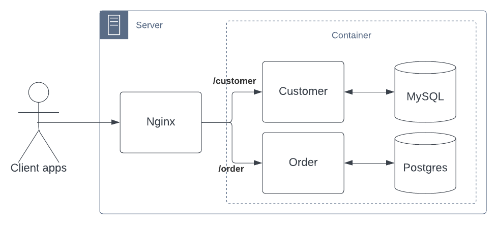

# Bootcamp DevOps - dockerfile

Test tahap pertama untuk peserta bootcamp tentang 

- konsep docker
- menjalankan container dengan docker
- build docker image berdasarkan workload tertentu
- microservice apps using Rest API
- memahami docker compose yaml

## Task 1 (install docker)

Teman-temen akan disedian sebuah virtual-machine (VM) untuk melakukan installasi docker

1. Install docker-engine
2. Configure insecure registry ke nexus oss yang telah di install, berikut configurasinya

  ```yaml
  server: 
    pull-access: 192.168.100.250:8086
    push-access: 192.168.100.250:8087
  cred:
    user: tabeldata
    pass: tabeldata
  ```

3. Jalankan container menggunakan image `192.168.100.250:8086/httpd:latest` dengan port export `8081`

4. coba akses dari local komputer temen-temen ke container tersebut, contohnya alamat server adalah `192.168.100.111` coba akses [http://192.168.100.111:8081](http://192.168.100.111:8081)

## Task 2 (build docker)

Disini saya punya architecture aplikasi yang akan dideploy seperti berikut:




### System requirement to run this project

- Java 17 or later
- Apache maven
- MySQL 8.0 or later, alternative using docker
- PostgreSQL 15 or later, alternative using docker

After your install pre-requirement, then you can download the dependencies using `mvn clean -DskipTests package` command.

### Module customer

Module customer using MySQL Database to store data about customer it self, to run this module you can type `mvn -DskipTests clean -pl customer spring-boot:run` command. After web server started now you can access rest api from [http://localhost:9090]

Before you start, you need modified the environment on `application.yaml` inside folder `customer/src/main/resources` such as datasource connection

For testing the rest api, you can use Postman or the other http client and import this http-request.

```http request
### request to customer
GET http://{{host}}:{{port}}{{context-path}}/api/customer/v1/findById/cust01
Accept: application/json
```

### Module order

Module order using PostgreSQL database to store about transaction order, to run this module you can type `mvn -DskipTests clean -pl orders spring-boot:run` command. After web server started now you can access rest api from [http://localhost:9091]

Before you start, you need modified the environment on `application.yaml` inside folder `ordes/src/main/resources` such as datasource connection, service customer connection 

For testing the rest api, you can use Postman or the other http client and import this http-request.

```http request
### Store request order from customer
POST http://{{host}}:{{port}}{{context-path}}/api/order/v1/checkout
Accept: application/json
Content-Type: application/json
Timeout: 3s

{
  "userId": "cust01",
  "item": "Macbook Pro 13\" (A1723)",
  "qty": "2"
}
```

Nah yang harus temen-temen kerjakan yaitu

1. Build docker image untuk masing-masing module `customer` dan `orders`
2. Membuat docker compose specification berdasarkan microservice tersebut
3. Setelah containernya running, coba test dengan menggunakan postman atau rest client apakah response dari rest client bisa connecti antara service order dengan customer.