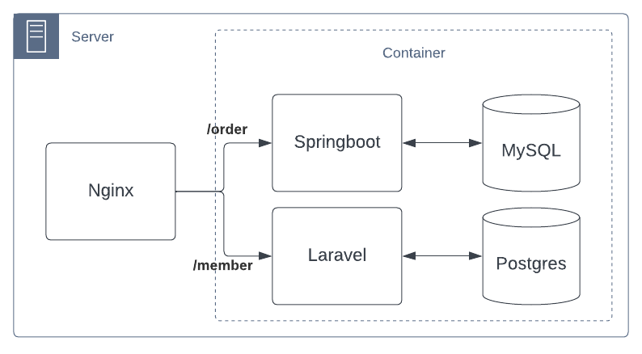

# Bootcamp DevOps - dockerfile

Test tahap pertama untuk peserta bootcamp tentang 

- konsep docker
- menjalankan container dengan docker
- build docker image berdasarkan workload tertentu
- memahami docker compose yaml

## Task 1 (install docker)

Teman-temen akan disedian sebuah virtual-machine (VM) untuk melakukan installasi docker

1. Install docker
2. Configure insecure registry ke nexus oss yang telah di install, berikut configurasinya

  ```yaml
  server: 
    pull-access: 192.168.100.250:8086
    push-access: 192.168.100.250:8087
  cred:
    user: tabeldata
    pass: tabeldata
  ```

3. Jalankan container menggunakan image `192.168.100.250:8086/httpd:latest` dengan port export `8081`

4. coba akses dari local komputer temen-temen ke container tersebut, contohnya alamat server adalah `192.168.100.111` coba akses [http://192.168.100.111:8081](http://192.168.100.111:8081)

## Task 2 (build docker)

Disini saya punya architecture aplikasi yang akan dideploy seperti berikut:

